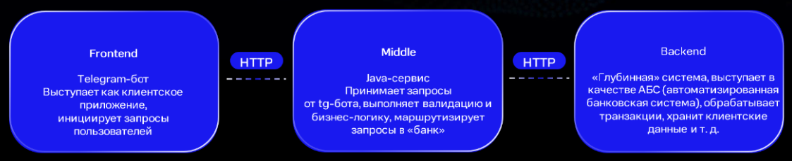

# Телеграм бот shaikhutdinova-telegram-bot

## Описание системы

Архитектура мини-банка состоит **из трех** компонентов,
telegram-bot является пользовательским интерфейсом, что взаимодействует с пользователем (фронт):

Слои архитектуры:
1. *frontend (telegram-bot на java/kotlin);*
2. *middle-слой (java/kotlin-сервис);*
3. *backend (java/kotlin-сервис).*



##  Технологический стек 

1. Язык: Java 17
2. Система сборки: Gradle 7.1
3. Базовый фреймворк: Spring Boot


## Установка

1. Скачать проект с репозитория 
2. Задать переменную окружения для бота TELEGRAM_BOT_TOKEN
3. В корневой папке проекта  запустить ./gradlew run

## FAQ

Часто задаваемые вопросы и ответы на них будут представлены в этом блоке

## Контакты
По всем вопросам, касающихся данного проекта Вы можете обратиться по на почту **@gu_code@mail.ru**


## Диаграмма последовательности

Данная диаграмма описывает взаимодействие компонентов бота "Мини-банк".

```plantuml  
@startuml
actor Client
participant TelegramBot as Telegram
participant MiddleLayer as Middle
participant BackLayer as Back

== /register: Регистрация пользователя ==
Client -> Telegram: /register
Telegram -> Middle: Отправка данных пользователя на мидл-слой
Middle -> Middle: Валидация данных
alt Данные валидны
  Middle -> Back: Запрос на регистрацию пользователя
  Back -> Middle: Уникальный идентификатор пользователя
  Middle -> Telegram: Успешная регистрация
  Telegram -> Client: Уведомление об успешной регистрации
else Данные не валидны
  Middle -> Telegram: Ошибка валидации
  Telegram -> Client: Уведомление об ошибке
end

== /createaccount: Открытие счета ==
Client -> Telegram: /createaccount
Telegram -> Middle: Запрос на открытие счета
Middle -> Back: Открытие счета для пользователя
Back -> Middle: Результат открытия счета
Middle -> Telegram: Уведомление о создании счета
Telegram -> Client: Уведомление об успешном открытии счета

== /currentbalance: Запрос текущего баланса ==
Client -> Telegram: /currentbalance
Telegram -> Middle: Запрос на текущий баланс
Middle -> Back: Запрос баланса
Back -> Middle: Текущий баланс
Middle -> Telegram: Баланс
Telegram -> Client: Отображение баланса

== /transfer [toTelegramUser] [amount]: Перевод средств ==
Client -> Telegram: /transfer [toTelegramUser] [amount]
Telegram -> Middle: Запрос на перевод средств
Middle -> Middle: Валидация данных
alt Данные валидны и достаточно средств
  Middle -> Back: Запрос на перевод средств
  Back -> Middle: Результат перевода
  Middle -> Telegram: Результат операции
  Telegram -> Client: Уведомление о результате перевода
else Данные не валидны или недостаточно средств
  Middle -> Telegram: Ошибка (валидация или недостаток средств)
  Telegram -> Client: Уведомление об ошибке
end
@enduml


